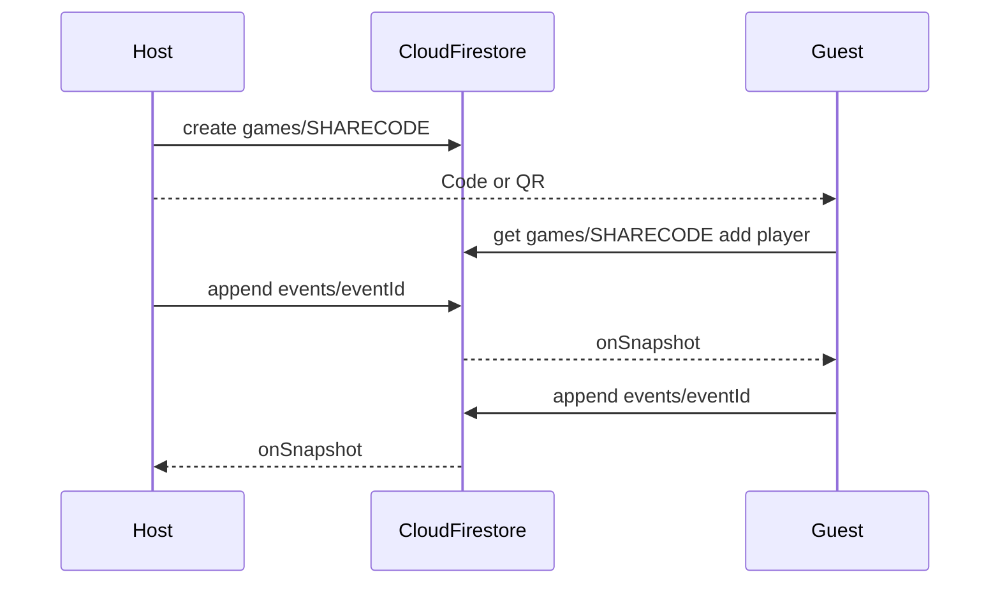

# ScoreForge architecture

ScoreForge is a score-keeping product. The **active implementation** is an Expo (React Native + TypeScript) app in [`mobile/`](../mobile/).

An earlier Avalonia/.NET prototype was removed from the tree; see git history if needed.

## Active stack (Expo)

```
mobile/
├── App.tsx                    # navigation + deep linking
├── firestore.rules            # Cloud Firestore security rules
├── firebase.json              # Hosting + Firestore config
├── src/
│   ├── firebase/              # app init + anonymous auth
│   ├── domain/                # models, templates, scoreCalculator, localPlayer
│   ├── storage/               # Firestore game store + known codes + displayName
│   ├── linking/               # share URL create/parse for QR + deep links
│   ├── navigation/            # types + React Navigation linking config
│   ├── screens/               # Home, Setup, Join, Board, Cribbage, Settings
│   └── components/            # CribbageBoard, FireworksOverlay, ShareCodePanel
```

### Startup / navigation

React Navigation native stack with `expo-linking` prefixes (`scoreforge://` and Expo URL):

| Screen | Role |
| --- | --- |
| **Home** | List known share codes; resume / delete |
| **Setup** | Template + host name → `createAndSaveGame` in Firestore |
| **Join** | Display name + code → fetch cloud game, add player |
| **Board** | Live subscribe; Free Play / Rounds / Rummy / Golf |
| **Cribbage** | Live subscribe; own-peg scoring + fireworks |
| **Settings** | Notes / future theme |

Deep link: `join?code=XXXXXX`. QR encodes `Linking.createURL('join', { queryParams: { code } })`.

### Cloud sync model



| Path | Contents |
| --- | --- |
| `games/{shareCode}` | Metadata: name, templateId, players, status, targets, timestamps |
| `games/{shareCode}/events/{eventId}` | Append-only score events |
| AsyncStorage `scoreforge.knownShareCodes` | Codes this device created or joined |
| AsyncStorage `scoreforge.displayName` | Local player name for own-score UI |

- Document id **is** the share code (easy join via `get`).
- **List** queries on `games` are denied in rules (cannot enumerate all games).
- Auth: silent **anonymous** Firebase Auth (enable in console).
- Board/Cribbage use `subscribeGame` for realtime updates.

### Domain

Event-sourced `Game` + append-only `ScoreEvent`s, template catalog, pure `calculate()`.

Own-score only: UI matches `displayName` to a player; only that player's scores can be changed/undone.

All templates start with `minPlayers: 1`; others join via code.

| Template | Mode | Win |
| --- | --- | --- |
| Free Play | Instant | Highest |
| Rounds | Per-player round scores | Highest |
| Rummy | Per-player round scores | First to target (500) |
| Golf | Per-player hole scores | Lowest after N holes |
| Cribbage | Instant pegging | First to 121 |

### Platforms

| Target | How |
| --- | --- |
| Web (dev) | `npm run web` |
| Web (public) | `npm run deploy:web` / `deploy:all` |
| Android / iOS (dev) | Expo Go + `npm start` |
| Stores | EAS Build later |

### Deploy checklist

1. Firestore database created  
2. Authentication → **Anonymous** enabled  
3. `mobile/.env` filled with web app config  
4. `npm run deploy:rules` then `npm run deploy:web`

## Legacy Avalonia notes

The Avalonia solution lived in earlier commits and is no longer part of the working tree.
