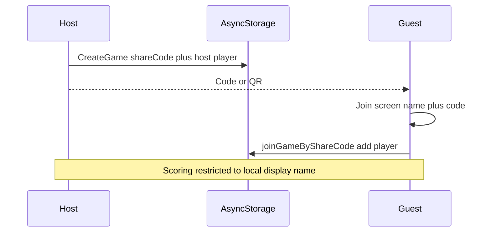

# ScoreForge architecture

ScoreForge is a score-keeping product. The **active implementation** is an Expo (React Native + TypeScript) app in [`mobile/`](../mobile/).

An earlier Avalonia/.NET prototype was removed from the tree; see git history if needed.

## Active stack (Expo)

```
mobile/
├── App.tsx                    # navigation + deep linking
├── src/
│   ├── domain/                # models, templates, scoreCalculator, localPlayer
│   ├── storage/               # AsyncStorage game + displayName stores
│   ├── linking/               # share URL create/parse for QR + deep links
│   ├── navigation/            # types + React Navigation linking config
│   ├── screens/               # Home, Setup, Join, Board, Cribbage, Settings
│   └── components/            # CribbageBoard, FireworksOverlay, ShareCodePanel
```

### Startup / navigation

React Navigation native stack with `expo-linking` prefixes (`scoreforge://` and Expo URL):

| Screen | Role |
| --- | --- |
| **Home** | List / resume / delete games; compact share code + QR |
| **Setup** | Template, options, **host display name only** (solo start) |
| **Join** | Display name + share code (prefilled from QR / deep link) |
| **Board** | Free Play, Rounds, Rummy, Golf |
| **Cribbage** | Pegboard + own-peg scoring + win fireworks |
| **Settings** | Notes / future theme options |

Deep link into join: path `join` with query `code` (e.g. `scoreforge://join?code=K7M2QX`). QR codes encode `Linking.createURL('join', { queryParams: { code } })`.

### Domain

Event-sourced `Game` + append-only `ScoreEvent`s, template catalog, pure `calculate()` for standings and completion.

| Field / concept | Notes |
| --- | --- |
| `shareCode` | 6-char unambiguous code on every game |
| Display name | Stored in AsyncStorage; identifies “you” on this device |
| Own-score only | UI only allows scoring / undoing for the local player (name match) |

| Template | Mode | Win |
| --- | --- | --- |
| Free Play | Instant | Highest |
| Rounds | Rounds (per-player “Add my score”) | Highest |
| Rummy | Rounds | First to target (500) |
| Golf | Rounds | Lowest after N holes |
| Cribbage | Instant pegging | First to 121 |

All templates: `minPlayers: 1`. Extra players join via share code.

### Sharing flow



### Persistence

| Key | Contents |
| --- | --- |
| `scoreforge.games` | Game list (incl. `shareCode`, players, events) |
| `scoreforge.displayName` | Last used display name |

Works in Expo Go, native builds, and web. Join currently resolves codes against **local** storage only; cloud sync (e.g. Firestore) is planned next.

### Platforms

| Target | How |
| --- | --- |
| Web browser | `npm run web` in `mobile/` |
| Android / iOS (dev) | Expo Go + `npm start` |
| Stores | EAS Build later |

## Out of scope (current tree)

- Google / Microsoft / Entra OAuth
- Realtime multi-device sync (codes work same-device until a sync layer lands)

## Legacy Avalonia notes

The Avalonia solution (shared MVVM core, desktop file store, browser `localStorage`) lived in earlier commits and is no longer part of the working tree.
