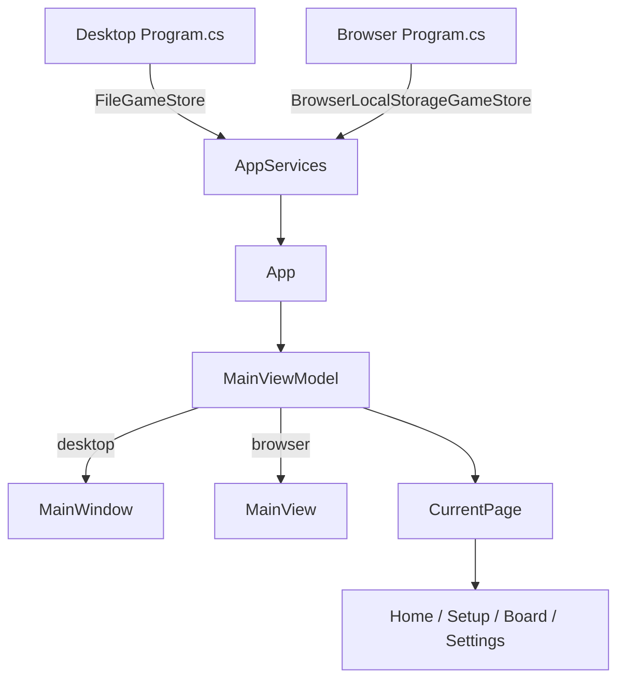

# ScoreForge architecture

Avalonia MVVM score-keeping app with a shared core and thin platform hosts.

## Solution shape

```
ScoreForge.slnx
├── ScoreForge/              # shared UI + domain (almost everything)
├── ScoreForge.Desktop/      # Windows/macOS/Linux host
├── ScoreForge.Browser/      # WASM host
└── tests/ScoreForge.Tests/  # scoring + file store tests
```

Central package versions live in `Directory.Packages.props` (Avalonia 12.1.2, CommunityToolkit.Mvvm). SDK is pinned in `global.json` to .NET 10.

## Startup flow



1. Host `Program.cs` registers storage, then starts Avalonia.
2. `App.OnFrameworkInitializationCompleted` builds a `MainViewModel` shell and attaches it to either `MainWindow` (desktop) or `MainView` (browser).
3. Navigation is swapping `CurrentPage` on the shell (`MainViewModel.NavigateTo`).

ViewModel → View mapping is explicit in `App.axaml` (no reflection `ViewLocator`), which is friendlier for WASM trimming.

Key files:

- [`ScoreForge.Desktop/Program.cs`](../ScoreForge.Desktop/Program.cs) — desktop host + `FileGameStore`
- [`ScoreForge.Browser/Program.cs`](../ScoreForge.Browser/Program.cs) — browser host + `BrowserLocalStorageGameStore`
- [`ScoreForge/App.axaml.cs`](../ScoreForge/App.axaml.cs) — lifetime-specific root view setup
- [`ScoreForge/ViewModels/MainViewModel.cs`](../ScoreForge/ViewModels/MainViewModel.cs) — shell navigation

## Domain layer

Located under `ScoreForge/Models`, `ScoreForge/Templates`, and `ScoreForge/Scoring`.

### Event-sourced game state

A `Game` holds players plus a list of `ScoreEvent`s. Totals are derived by `ScoreCalculator`, not stored on the game.

| Type | Role |
| --- | --- |
| `Game` | Session: id, name, template id, players, events, status, optional target/max rounds |
| `Player` | Id + display name |
| `ScoreEvent` | Player id, points, optional round number, timestamp |
| `GameStatus` | `InProgress` / `Completed` |

### Templates

`IGameTemplate` describes rules without owning game state. `GameTemplateCatalog` is the registry.

| Template | Mode | Win condition |
| --- | --- | --- |
| Free Play | Instant +/− | Highest total |
| Rounds | Round entry | Highest total |
| Rummy | Round entry | First to target (default 500) |
| Golf | Round = hole | Lowest total after N holes |
| Cribbage | Instant pegging on a board view | First to 121 (configurable to 61) |

Enums: `ScoringMode` (`Instant` / `Rounds`), `WinCondition` (`HighestTotal` / `LowestTotal` / `FirstToTarget`).

### ScoreCalculator

Pure logic (no Avalonia types): sum events → standings → detect completion/winner. Primary unit-test surface in `tests/ScoreForge.Tests/ScoreCalculatorTests.cs`.

## Persistence

`IGameStore` is the only storage contract: `LoadAll` / `Save` / `Delete`.

| Implementation | Where | Backend |
| --- | --- | --- |
| `FileGameStore` | shared; used by Desktop | `%AppData%/ScoreForge/games.json` |
| `BrowserLocalStorageGameStore` | Browser project | `localStorage` via `[JSImport]` |
| `InMemoryGameStore` | fallback / designer | in-memory |

Hosts wire the real store via `AppServices.Configure(...)` before the UI starts. ViewModels call `AppServices.GameStore` and autosave after scoring actions.

Browser JSON uses a source-generated `GameJsonContext` for trim-friendly serialization.

## UI screens

| Page | ViewModel | View | Job |
| --- | --- | --- | --- |
| Shell | `MainViewModel` | `MainView` (+ `MainWindow` on desktop) | chrome: Home / New Game / Settings |
| Home | `HomeViewModel` | `HomeView` | list, resume, delete games |
| Setup | `SetupViewModel` | `SetupView` | pick template, players, target/holes |
| Board | `BoardViewModel` | `BoardView` | Free Play cards or round grid |
| Settings | `SettingsViewModel` | `SettingsView` | System / Light / Dark via `ThemeService` |

`BoardViewModel` is the largest piece for generic templates:

- **Instant mode** — +/− score events per tap
- **Rounds mode** — collect one score per player, append a round of events
- **Undo** — remove last tap, or last entire round
- After every change: refresh via `ScoreCalculator`, then persist

Cribbage uses a dedicated `CribbageBoardViewModel` + `CribbageBoardView` with a custom `CribbageBoardControl` that draws serpentine tracks and front/rear pegs. `BoardNavigation.CreateBoard` routes to it when `TemplateId` is `cribbage`.

## Typical session

1. Home loads games from the store.
2. Setup creates a `Game` with template id + players → save → navigate to Board.
3. Board appends `ScoreEvent`s → recalculate → save.
4. Rummy/Golf can auto-complete when target/holes are hit; the user can also mark complete.

## Tests and tooling

- `ScoreCalculatorTests` — Free Play, Rounds, Rummy target, Golf lowest-wins, catalog
- `FileGameStoreTests` — JSON round-trip
- CI (`.github/workflows/build.yml`) — restore, build, test, publish Desktop
- Browser requires `dotnet workload install wasm-tools` and `WasmBuildNative=true` so Skia links into the WASM payload

## High-leverage files

| File | Why |
| --- | --- |
| `ScoreForge/ViewModels/BoardViewModel.cs` | Gameplay UX and scoring commands |
| `ScoreForge/Scoring/ScoreCalculator.cs` | Rules and completion |
| `ScoreForge.Desktop/Program.cs` / `ScoreForge.Browser/Program.cs` | Platform wiring |
| `ScoreForge/App.axaml` | ViewModel ↔ View templates + Fluent theme |
